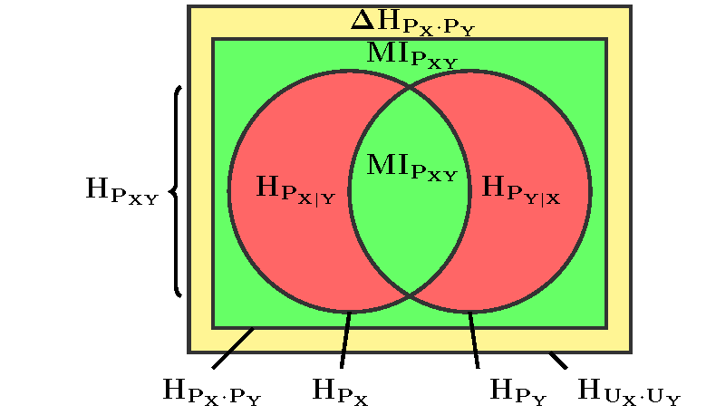

# Building Data Products Project: A Demonstrator for the Entropy Triangle

The Entropy Triangle is an exploratory analysis *for classifier evaluation*. Instead of trusting in classification accuracy which is highly unreliable it suggests considering the entropies involved in the **confusion matrix** of a particular classifier on a particular dataset.

## The balance equation 

Suppose you have a dataset on which you train a classifier to obtain a confusion matrix (in our examples, by 10-fold cross-validation) to estimate the performance of the classifier in unseen data. 

Consider the reference classes $X$ and the predicted classes $Y$ and the confusion matrix of the classifier $N_{XY}$. 

The confusion matrix can be transformed into  joint (count) distribution $P_{XY}$ whose marginals are discrete (count) distributions over $P_X$ $P_Y$. Note that distribution $P_X$ is the distribution of reference labels in the dataset, while $P_Y$ is, in some sense, build by the classifier.

If the dataset was balanced, then $P_X$ would be the uniform discrete distribution $U_X$, with maximum entropy $H_{U_X}=\log{|X|}$, where $|X|$ is the number of classes in $X$. Likewise, if the output was balanced, then $P_Y = U_Y$ with $H_{U_Y}=\log{|Y|}$. In any other case, we can measure the difference between the entropies as $\Delta H_{P_X} = H_{U_X} - H_{P_X}$  and $ $\Delta H_{P_Y}= H_{U_Y} - H_{P_Y}$, and add them $\Delta H_{P_{X}\dot{}P_{Y}}=  \Delta H_{P_X} + \Delta H_{P_Y}$.

We can relate these differences to the Mutual Information $MI_{P_{XY}}$ and to the conditional entropies as per the following well-known diagram:

So we can write a balance equation for these entropies (like adding the yellow, green and red areas):
$$
H_{U_X}+H_{U_Y} = \Delta H_{P_{X}\dot{}P_{Y}} + 2* MI_{P_{XY}} + VI_{P_{XY}}
$$
where the *variation of information* is just the addition of the conditional entropies $VI_{P_{XY}} = H_{P_{X|Y}} + H_{P_{Y|X}}$.

Then it is very easy to transform this into the equation of a simplex by dividing by the maximal entropies $H_{U_X}+H_{U_Y}$ to get the equation of a simplex:
$$
1 = \Delta H'_{P_{X}\dot{}P_{Y}} + 2* MI'_{P_{XY}} + VI'_{P_{XY}}
$$

And such simplices can be represented very conveniently as ternary De Finetti diagrams:
+ We are trying to maximize the Mutual Information between input labels and output labels, so we'll use height to represent $2* MI'_{P_{XY}}$ (it is measured in the right axis). 

+ The $\Delta H'_{P_{X}\dot{}P_{Y}}$ is the coordinate that measures how **unbalanced** the dataset it, so we will measure it along the lower side of the triangle: balanced at the left, completely unbalanced at the extreme right. 

+ The variation of information is actually how much entropy (energy, information, etc.) the classifier has chosen to ignore! it is measures in the left axis.