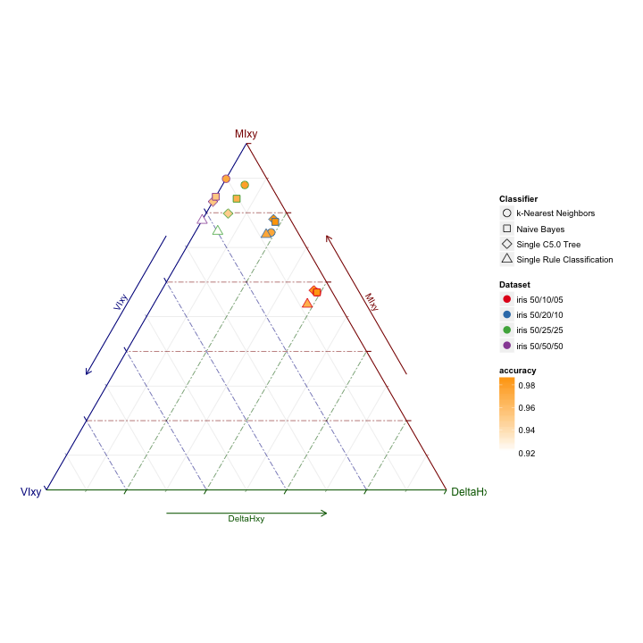

Entropic Assessment of Multiclass Classifiers
========================================================
author: Francisco J Valverde
date: Thu Feb 19 19:14:42 2015

Problems with Classifier Evaluation
========================================================

In multiclass tasks it is often the case that the class distribution is deeply
*unbalanced*.

In this case, the usual assessment tools are overly optimistic (*think of a classifier specializing in the majority class!*)
<!-- - The accuracy
- The ROC
- The confusion matrices (and heatmaps)
-->

We are going to introduce two tool:
- An exploratory analysis tools, the **Entropy Triangle**
- an entropy-modified measure of accuracy **EMA**, that corrects for class imbalance in the datasets.

Entropy Balance of a Joint Distribution
========================================================

Given two R.V. X and Y, the entropies related to them can be decomposed as:
<!-- We can write the following *balance equation*: -->
$$
\log |X| + \log |Y| = \Delta{H_{P_X \cdot P_Y}} + 2\cdot MI_{P_{XY}} + (H_{P_{X|Y}} + H_{P_{Y|X}})
$$
 
<!-- where $MI_{P_{XY}}$ is the mutual information-->

The Entropy Triangle
========================================================

The entropy triangle is the De Finetti triangle of these entropies.

Assessing a Classifier
========================================================

To assess a classifier on a dataset:

1. Obtain its confusion matrix
2. Work out the entropies 
in the balance equation
3. Represent them in the ET:
***
 
